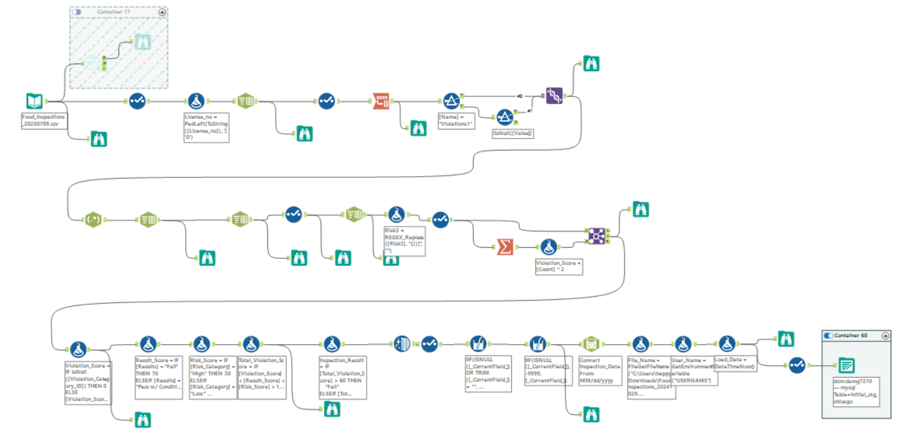
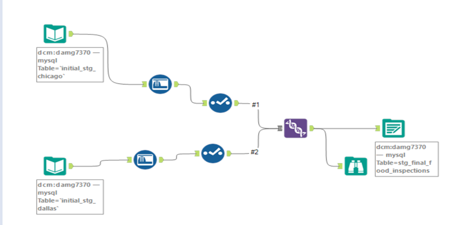
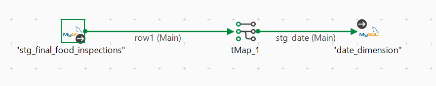

# 🍽️ Food Inspection Intelligence Dashboard – A Data Engineering & BI Case Study

**By Saipavan Katta**  
Tools: Alteryx · Talend · MySQL · ER/Studio · Power BI · Tableau · SQL

---

## 🚀 Project Summary

This project delivers a full-stack data analytics solution for analyzing **food safety inspections** across **Chicago** and **Dallas**. From messy raw datasets to clean, modeled, and visualized insights — every step was built with scalability and stakeholder usability in mind.

The project simulates the real-world journey of a **data engineer + analyst**, including:
- Combining multi-source government data
- Building an ETL pipeline
- Designing a star schema
- Delivering interactive dashboards to monitor risk, compliance, and violations

---

## 🎯 Business Challenges Solved

- Identify **high-risk facilities** based on inspection results
- Highlight **common violations** and their frequency
- Evaluate **facility compliance** by type, location, and inspection type
- Analyze **geographic risk concentration** using map visuals
- Create **on-demand inspection reports** filtered by  facility, or inspection ID

---

## 🗂️ Dataset Overview

- **Chicago**: Official food inspections dataset from [City of Chicago Open Data](https://data.cityofchicago.org/Health-Human-Services/Food-Inspections/4ijn-s7e5/data_preview)
- **Dallas**: Health inspections data from [Dallas Open Data](https://www.dallasopendata.com/Services/Restaurant-and-Food-Establishment-Inspections-Octo/dri5-wcct/about_data)

Both datasets were profiled, cleaned, and transformed to create a **unified analytical model**.

---

## 🧱 Technical Stack & Architecture

| Layer | Tools Used | Description |
|-------|------------|-------------|
| **Data Profiling** | Alteryx | Cleaned and analyzed raw data for nulls, outliers, and inconsistent formats |
| **ETL Development** | Alteryx & Talend | Built jobs to clean, transform, and load data into MySQL |
| **Dimensional Modeling** | ER/Studio | Designed a star schema with fact and dimension tables |
| **Data Warehouse** | MySQL | Stored the final analytical data model |
| **Data Visualization** | Power BI | Created dashboards for inspection monitoring and insights |

## Project Steps

### Step 1: Understanding the Dataset, Business Requirements
- Analyzed the schema and content of the provided datasets.
- Devise a plan of execution to prepare the data to answer business requirements.

### Step 2: Data Profiling in Alteryx
- Imported datasets into Alteryx.
- Utilized Alteryx tools for data profiling and derived insights such as datatype, percentage of missing values, percentage of nulls, shortest and longest value along with inferences observed for each column.

### Step 3: Devising a Common Schema for the Final Table
- Designed a schema for the final table based on the data available in both datasets and the business requirements.

### Step 4: Data Transformation
- Addressed missing values by replacing nulls with -9999 for numerical columns and NA for text fields.
- Extracted meaningful attributes by splitting single columns into multiple and merging related columns.
- Removed junk text and irrelevant characters using regex patterns to enhance data quality.
- Capitalized all text for consistency, applied uniform decimal precision, and standardized timestamps to the desired format.
- Adjusted column values with zero-padding or truncation to ensure uniformity across datasets.
- Derived additional attributes to meet business requirements through calculated fields.
- Added audit columns for traceability.
- Loaded the transformed data into a final staging table in MySQL DB, ensuring readiness for dimensional modeling.

  #### Pipeline created for Dallas:
  

  #### Pipeline created for Chicago:
  

  #### Pipeline created to combine both datasets into one:
  

### Step 5: Dimensional Modeling in ER Studio
- Designed a dimensional model based on business requirements, including fact and dimension tables.
- Generated a physical model and DDL scripts.
- Executed the scripts in Snowflake to create the dimensional schema.

  #### Dimensional Model Prepared:
  

### Step 6: Data Loading into Dimensional Models using Talend
- Loaded data into the dimensional model in MySQL using Talend.
- Added audit columns to ensure data traceability.

  
  
  
  
  
  
  

### Step 7: Connecting to BI Tools
- Established connections to Snowflake in Tableau and Power BI.
- Focused on creating dashboards that are simple, clean, and highly functional for end-users.
- Positioned filters at the top beside the title for easy access, highlighted key performance indicators (KPIs) on the right, and arranged the remaining visualizations in the center.
- Ensured Tableau and Power BI dashboards mirrored each other in design, enabling business partners to switch between platforms seamlessly based on their convenience.
- Published dashboards to the cloud for accessibility and real-time monitoring.

  #### Power BI:
  

  

## 📈 Project Highlights

- Designed and implemented a **complete ETL-to-dashboard pipeline**
- Standardized data from **two structurally different city datasets**
- Applied **regex and Alteryx transformations** to fix location/violation fields
- Built a **reusable dimensional model** for inspection reporting
- Demonstrated **data storytelling and KPI alignment** in BI dashboards

---

